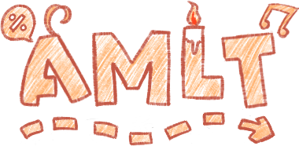

</img>
# YeziiBot-JS<br><span style="font-weight:normal;font-size: 20px;">Chatbot Framework for AMLT</span>
YeziiBot-JS is a modular, easy to use chatbot framework for AMLT written in a JavaScript-like language.

## Background
YeziiBot is a series of chatbot framework developed or co-developed by LovelyA72 featuring the character of Kashouryo (何小綾). Started as a fork of kjBot QQ chatbot framework, YeziiBot-v1 and YeziiBot-v2 were written in PHP and leverages the power CoolQ framework. YeziiBot-v3 was the first version that uses the Java programming language and served as a transitional version to the Kotlin powered YeziiBot-v4.

Starting from YeziiBot-JS, YeziiBot is no longer a QQ chatbot software. Instead, it powers AMLT, the desktop shimeji framework. It also became character agnostic, which allows the user or developer to create any character they wish to create.

## Structure

```
/
|--chats/ # Non-command processors
|--commands/ # Command modules
    |--......
|--main.js # Main file of YeziiBot-JS. Contains entry point functions
|--...... # Helper files that provides various run-time helper functions 
```